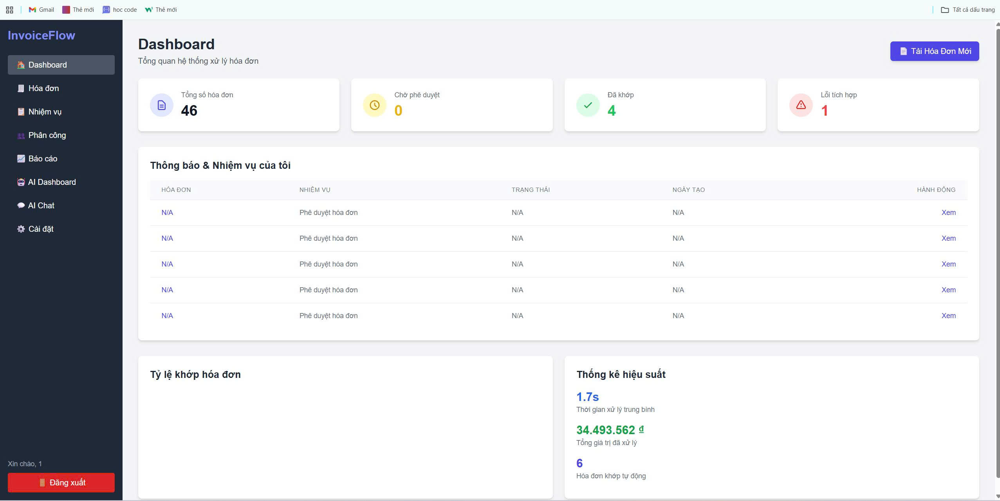
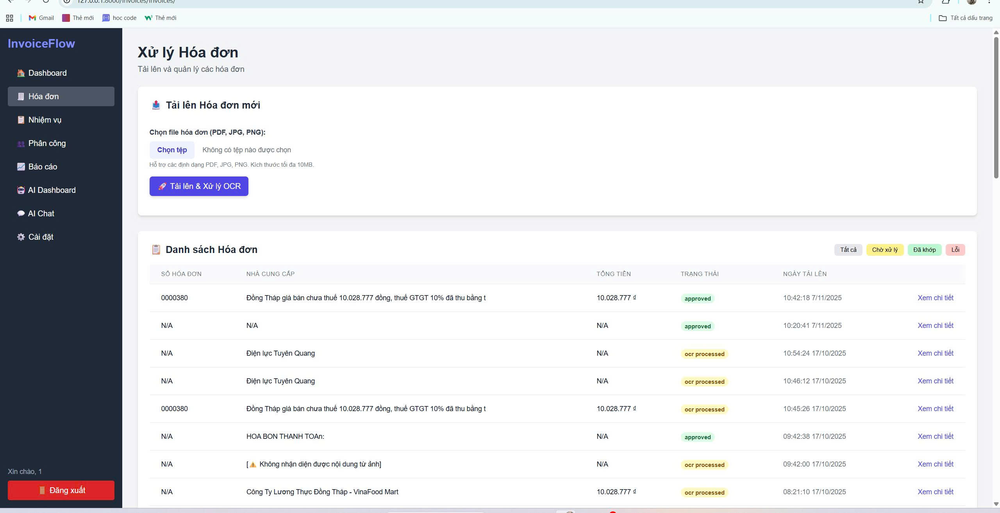
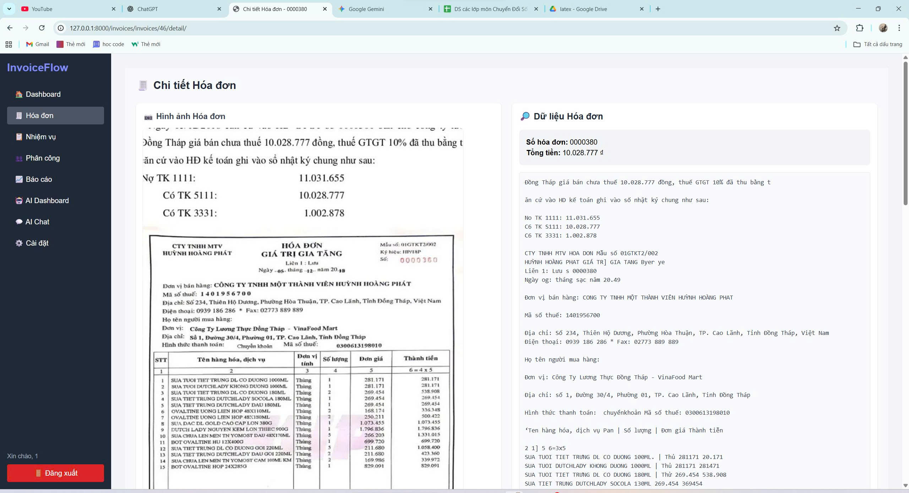
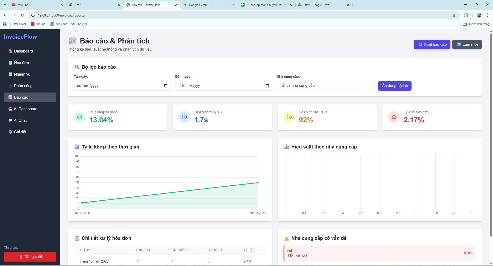

<h2 align="center">
  <a href="https://dainam.edu.vn/vi/khoa-cong-nghe-thong-tin">
  🎓 Faculty of Information Technology (DaiNam University)
  </a>
</h2>

<h2 align="center">
  Hệ thống Nhận dạng và Đối chiếu Hóa đơn Tự động Tích hợp ERP
</h2>

<div align="center">
  <p align="center">
    
    
    
  </p>

  [](https://www.facebook.com/DNUAIoTLab)
  [](https://dainam.edu.vn/vi/khoa-cong-nghe-thong-tin)
  [](https://dainam.edu.vn)
</div>


# 📄 1. Giới thiệu

Hệ thống **Xử lý và Quản lý Hóa Đơn Tự Động** là một website hỗ trợ doanh nghiệp hoặc cá nhân theo dõi, lưu trữ và phân tích dữ liệu hóa đơn.  
Thông qua việc tích hợp OCR, hệ thống có thể **nhận diện thông tin trên hóa đơn hình ảnh/PDF** và chuyển thành dữ liệu có cấu trúc để lưu trữ và tra cứu.

Hệ thống giúp giảm thời gian nhập liệu thủ công, hạn chế sai sót và tối ưu quy trình kế toán – lưu trữ hóa đơn.

### 🎯 Mục tiêu chính

- Nhận diện và trích xuất thông tin hóa đơn bằng **Machine Learning / OCR**.
- Lưu trữ hóa đơn điện tử an toàn, tra cứu thuận tiện.
- Cung cấp **bảng điều khiển (Dashboard)** để theo dõi số lượng hóa đơn, tổng tiền theo thời gian.
- Phân quyền người dùng và đảm bảo tính bảo mật.

---

## 🧩 Chức năng chính

### 1.1 Frontend

**Giao diện người dùng**

| Trang | Chức năng |
|------|-----------|
| Trang đăng nhập | Quản lý tài khoản người dùng |
| Trang danh sách hóa đơn | Hiển thị toàn bộ hóa đơn đã lưu |
| Trang chi tiết hóa đơn | Xem toàn bộ dữ liệu được OCR trích xuất |
| Trang tải lên hóa đơn | Upload hình ảnh/PDF hóa đơn vào hệ thống |
| Dashboard | Thống kê số lượng và tổng giá trị hóa đơn |

**Giao diện quản lý**

| Trang | Chức năng |
|------|-----------|
| Quản lý hóa đơn | Chỉnh sửa / xóa / xem lịch sử hóa đơn |
| Quản lý người dùng *(nếu có)* | Phân quyền tài khoản |
| Cấu hình OCR | Điều chỉnh mô hình xử lý OCR |

### 1.2 Backend

- **Xử lý OCR**: Tự động trích xuất văn bản từ hóa đơn.
- **Quản lý dữ liệu**: Lưu thông tin hóa đơn vào database.
- **REST API**: Kết nối qua Django REST Framework để Frontend truy cập.
- **Bảo mật**: Xác thực đăng nhập bằng Session / Token.

### 1.3 Database

| Bảng | Mục đích |
|------|---------|
| Users | Quản lý người dùng |
| Invoices | Lưu thông tin hóa đơn trích xuất |
| InvoiceItems | Lưu danh sách sản phẩm/dịch vụ của từng hóa đơn |
| Logs *(tùy chọn)* | Lưu lịch sử chỉnh sửa / thao tác |

---

# 🔧 2. Công nghệ sử dụng

| Thành phần | Công nghệ |
|-----------|-----------|
| Frontend | HTML, CSS, JavaScript, Bootstrap |
| Backend | Python – Django |
| OCR | Tesseract OCR / EasyOCR |
| API | Django REST Framework |
| Database | SQLite / MySQL (tùy triển khai) |

### 📚 Thư viện chính

- django
- djangorestframework
- pillow
- pytesseract / easyocr
- numpy
- bootstrap

---

# 🗄️ Cơ sở dữ liệu

Hệ quản trị: **SQLite** (mặc định, có thể chuyển sang MySQL)

Các bảng chính:

Users (id, username, password, role)
Invoices (id, code, date, total_amount, supplier, image_path, created_at)
InvoiceItems (id, invoice_id, item_name, quantity, price)

yaml
Sao chép mã

---

# 🖥️ 3. Công cụ & Môi trường phát triển

| Công cụ | Phiên bản đề nghị |
|--------|-------------------|
| Python | 3.8+ |
| Django | 4.x |
| Tesseract | 5.x |
| Visual Studio Code | Mới nhất |
| Hệ điều hành | Windows / Linux / macOS |

---

# 🚀 4. Cài đặt và chạy dự án

### Bước 1: Tạo môi trường ảo
```bash
python -m venv venv
venv\Scripts\activate       # Windows
source venv/bin/activate    # Linux/Mac
```
### Bước 2: Cài thư viện cần thiết
```bash
pip install -r requirements.txt
```
### Bước 3: Chạy migrate database
```bash
python manage.py migrate
```
### Bước 4: Chạy server
```bash
python manage.py runserver
```
Truy cập trình duyệt:
```bash
[python manage.py runserver](http://127.0.0.1:8000)
```
# 📝 5. Một số hình ảnh giao diện
### Hình 1: Giao diện chính

### Hình 2: Giao diện tải hóa đơn

### Hình 3: Giao diện OCR

### Hình 4: Giao diện báo cáo và phân tích

## 5. Liên Hệ
Họ tên: Nguyễn Tiến Dũng

Lớp: CNTT16-01

Email: dungnguyen190224@gmail.com

Zalo: 0987047451
